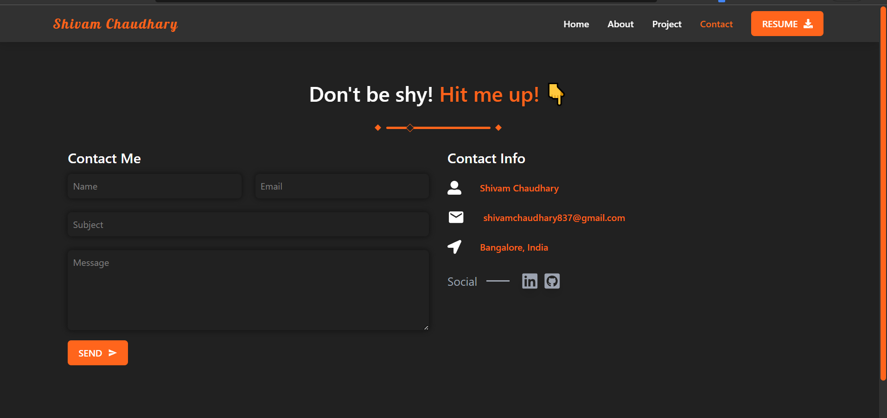

<h1 align ="center" >Harshita Prajapati | Portfolio</h1>

<h5  align ="center"> 
Dedicated Front-end developer. Capable to solve working problems. Passionate about learning & development to reach the target. Eager to tackle more complex problems and continue to find ways to maximize user efficiency. My next mission is how to become a Mern stack Developer. I would love to build some Giant Website which will shine myself. <br/> <a href="https://drive.google.com/file/d/1DUlrQ7fD4bbuDFtMEmF0b9LqbnOuDfOx/view?usp=drivesdk">Resume 💼</a> </h5>
<br/>

 


## Configuration and Setup

In order to run this project locally, simply fork and clone the repository or download as zip and unzip on your machine.

- Open the project in your prefered code editor.

In the first terminal

```
$ npm install 
$ npm run start
```

##  Key Features

- Home
- About
- Project 
- Contact


<br/>

##  Technologies used

This project was created using the following technologies.

- [React js ](https://www.npmjs.com/package/react) - JavaScript library that is used for building user interfaces specifically for single-page applications
- [react-router-dom](https://www.npmjs.com/package/react-router-dom) - To handle routing
- [Css](https://developer.mozilla.org/en-US/docs/Web/CSS) - For User Interface
- [React icons](https://react-icons.github.io/react-icons/) -
 Small library that helps you add icons  to your react apps.
 - [Tailwind CSS](https://tailwindcss.com/) - For User Interface
- [React Hooks  ](https://reactjs.org/docs/hooks-intro.html) - For managing and centralizing application state
- [daisyUI  ](https://daisyui.com/docs/changelog/) - For User Interface

 ##  Screenshots 
 





## Author
- Portfolio: [harshitaprajapati]( https://portfolio-hp-one.vercel.app/about)
- Github: [harshitaprajapati31]( https://github.com/harshitaPrajapati31)
- Linkedin: [harshita-prajapati31]( https://www.linkedin.com/in/harshita-prajapati31/)
- Email: [harshitap559@gmail.com]( mailto:harshitap559@gmail.com)

## License

License

Copyright (c) 2024 Harshita Prajapati

Permission is hereby granted, free of charge, to any person obtaining a copy
of this software and associated documentation files (the "Software"), to deal
in the Software without restriction, including without limitation the rights
to use, copy, modify, merge, publish, distribute, sublicense, and/or sell
copies of the Software, and to permit persons to whom the Software is
furnished to do so, subject to the following conditions:

The above copyright notice and this permission notice shall be included in all
copies or substantial portions of the Software.

THE SOFTWARE IS PROVIDED "AS IS", WITHOUT WARRANTY OF ANY KIND, EXPRESS OR
IMPLIED, INCLUDING BUT NOT LIMITED TO THE WARRANTIES OF MERCHANTABILITY,
FITNESS FOR A PARTICULAR PURPOSE AND NONINFRINGEMENT. IN NO EVENT SHALL THE
AUTHORS OR COPYRIGHT HOLDERS BE LIABLE FOR ANY CLAIM, DAMAGES OR OTHER
LIABILITY, WHETHER IN AN ACTION OF CONTRACT, TORT OR OTHERWISE, ARISING FROM,
OUT OF OR IN CONNECTION WITH THE SOFTWARE OR THE USE OR OTHER DEALINGS IN THE
SOFTWARE.
